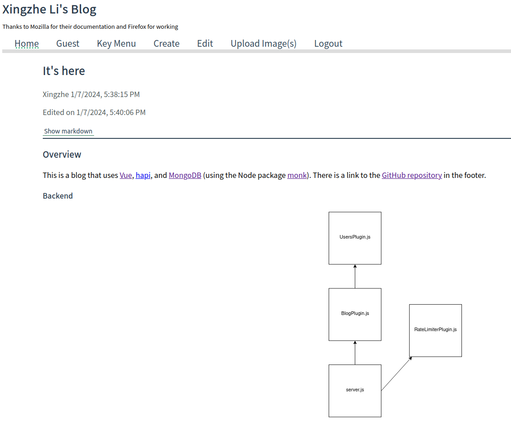

# liblogx

This is a full-stack blog website made mostly in 2020. It uses Vue, hapi.js, and MongoDB.

## Setup
1. Install Node 14, e.g. via [nvm](https://github.com/nvm-sh/nvm#install--update-script).
2. Install and start a [`MongoDB`](https://www.mongodb.com/docs/manual/administration/install-community/#std-label-install-mdb-community-edition) server.
3. Edit the .env file as needed.
4. In the project's root directory, run the shell command `npm run setup` using Node 14.
5. Run `npm start`.
6. Connect to `http://localhost:${port number in .env}/` in a browser.

## Features

- Upload images and write posts in markdown

- Edit posts

- Syntax highlighting via [highlight.js](https://highlightjs.org/)

- Switch between rendered and raw markdown view

- Control user registration by requiring special keys

- Change UI and separate posts based on whether the user is privileged

## License
[0-BSD](LICENSE)